# Assignment 1: UX Design Report

- **Author**: Fletcher Barry, Marcus McInerney, Caden Yates, Joushua Hearne, Oliver Munro
- **FAN**: barr0606, mcin0389, yate0081, hear0098, munr0117
- **Student ID**: 2368193, 2401481, 2240440

[Comment]: # (Create your UX Design Report in this file.)

---
# Website Purpose (Fletcher Barry)
This website’s purpose is for customer to adopt animals for themselves, for their kids, to get company for other pets, or to give a pet to a loved one as a gift. It would serve as a way for people to adopt animals, and for a way for the shelter to get more adoptions. The problem this website would solve is that the shelter may be struggling to get pets adopted without as much accessibility that a website may give. It also provides a way for customers to see pets that they may like without needing to be onsite, and potentially risking some allergies, depending on what pet that they may want. The website would make adopting animals from this shelter much more accessible due to prevalent technology is now days, and how people would be more familiar and more comfortable with “online shopping” rather than going to a shelter and seeing the animals in person.     The target audience for this website is someone who maybe some what technologically smart, whilst being at an age that could afford to own a pet. This person may also be from a middle to high income household. There may be several reasons why this user may be on this website, for example, they could be looking for a pet for any kids they may have, or they could be looking for another pet after they lost a different pet or if a loved one may have passed away. There are several locations where this website may be accessed from, including home, university, or work. The internet connection for each site may vary.     There are going to be several different pages accessible throughout the website, you would start at the home page, where you would be able to access most of the other pages from there. The accessible pages would be the search page, about us, contact us, support, adoption details, and a blog page. There would be three other pages accessible only through using the search function and onwards. The first page accessible would be the search results page, which would show all related pets to the customers defined search criteria. The next page accessible would be the pet information page which would be accessed by clicking on one of the pets that would have shown up in the search results page. The next page would be the customer details, where the customer would put in their details to meet up with the animal of their choosing, this page would be entered upon selecting a button in the pet details page that would ask if they wanted to meet the animal. The last page accessible before returning to the home page would be the inquire page, this would show up after the customer has organized a time to meet the pet, this page would contain details about how the meeting may go and what behaviour the pet may present. It would also say how the customer may go about contacting the business regarding any questions or schedule updates that may arise. 

# User Details
**PACT Analysis Matrix**

| PACT Items | PACT Content |
| --- | --- |
| **People (Fletcher Barr)** | o	People that may go to the site, may have a wide variety of physical attributes. Some of these attributes may include those with disabilities that are maybe looking for a service animal. Some people may also be looking for a pet as an excuse to maybe get some exercise like going on a walk with a dog. Various ages would use the website, but it is unlikely that older people would use the site, due to most being unfamiliar with technology. Children are also unlikely to use the website, and if they were to, they would most likely be on there to look at the cute animals. The most likely age range would be teenagers to adults, due to this demographic being the most familiar with technology, and would also have the finances to adopt an animal for themselves, their family, or for someone that may need/want an animal. For example, and adult may want to get pet to help one of their parents from feeling lonely, and to give them something to do during their retirement.   o	The people that might be looking for a pet are people who may have recently lost a loved one or a pet, someone who wants to look after an animal, someone who may want to help rehome rescue animals. Some people may want to get a pet so they could get the feeling of looking after something without having to commit looking after a child.   o	People in lower-income households may not visit the website to look for a pet due to either not access to the right technologies or may not be able to feed another mouth. People in medium-income households would be the demographics that are most likely to visit our site due to having the right technology available to them, being able to afford to feed another mouth. It is also unlikely that medium-income households would want to adopt purebred’s due to how much they cost. There would be high-income households visiting the website than medium-income households due to their financial stability, and that high-income households may prefer to buy younger purebred animals or more exotic animals.   o	There would three type of users that would use the website: The Admin, the employees, and the adopters/customers. |
| **Activities** (Yate0081) |- Browsing through pet listings   - Reading pet profiles   - Viewing images/videos of the pets   - Completing an application process   **Temporal** -   As users may casually browse at first to search for a pet that meets there desire, this process may take place over multiple sessions. This can result in time pressure as a pet they may end up desiring recieves other aplications. Once the application has been submitted users will need to wait for a decision to be made from the shelter after review. Providing a favourites option may reduce time browsing along with notifications for updates on pets or similar breeds.   **Cooperation** -   Users are more likely to browse individually followed by a discussion with family members to make a final decison. Communication and cooperation while completing an application requires shelter staff. The website will need to provide discussion channels and tools to allow users to share chosen profiles with family memebers.   **Complexity** -   The Complexity activities depend on the task undertaken, the layout of the site should make it easy for the user to navigate,from general searching to using filters to scope out certain breeds aswell as moving through photos of a desired pet, whereas completing the application process and ensuring the suitablity between the family and pet is optimal can be more difficult and take time.    **Safety**-   Whilst there are no physical risks in searching for a pet online, there are risks assosiated to the users actions. If the match between the owner and the pet is illmatched this can cause stress or result in unsuitable living conditions for the animal. It is important that accurate and detailed information on the pet is provided along with clear instructions of the process the user will take to adopt, this will minimise risk that can cause stress to the user, animal and shelter staff as rehoming a pet may be difficult.    
| **Context (Marcus McInerney)** | Users may access the website in different environments such as at home, university, or work. They may experience distractions, time pressure, or noise depending on the situation. Internet connection may vary, so the system should be easy to use even with slower speeds. The design should support quick navigation and clear information so users can complete tasks efficiently in different contexts. |
| **Technologies (Joshua Hearne)** | Firstly the required inputs from the users would be mainly submitting adoption papers/applications and user inputs into the search filter.Adoption applications contain sensitive information so HTTPS with a SSL certificate would need to be implemented to keep user data secure. For the outputs the website for maximum user engagement pictures and videos for each pet on the website would be optimal. Videos and photos would need to be hosted and formatted appropriately. The website would also need to have a mobile format as well. For communication the main concern would be needing to develop a system that would keep all pet listings accurate. Adoption centre to user messaging does not need to be considered because within the adoption application a further contact point for the user would be listed such as phone or email. The content of this site would mainly be refering to the listing of each pet. Some catergories that would need to be covered include; age, weight, breed/species, temperament and colour. A short medical history would also need to be listed including; microchip status vaccination history, health conditions, date of last checkup and desexed or not. All of this information would need to be verified as accurate this could be done through something such as a two step process with a shelter suggesting a change then having someone from the shelter verify it with a code sent in a text. |

**User Persona**

- Fletcher Barry

- Marcus McInerney

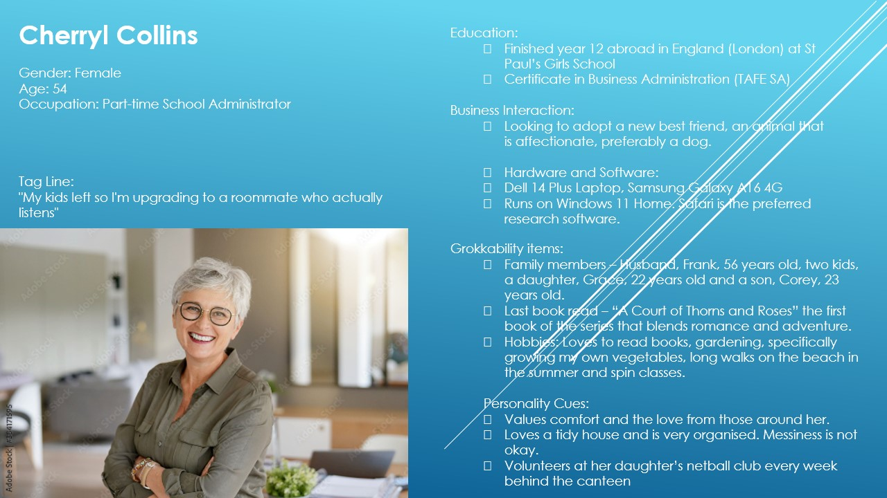
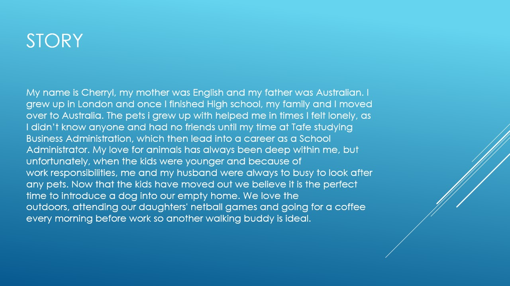
- Caden Yates  (Yate0081) - Cherryl Collins

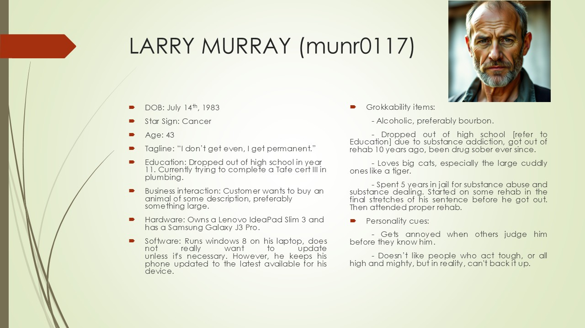
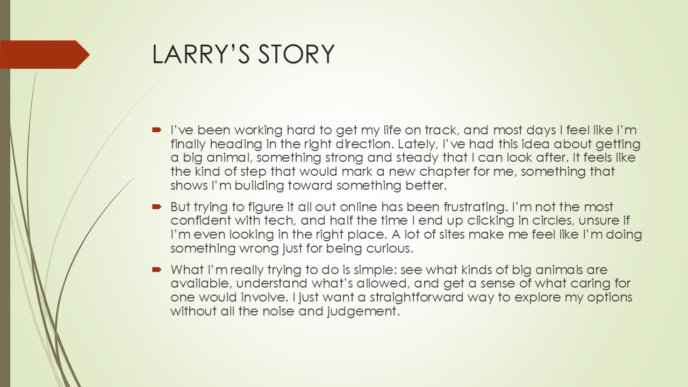
- Oliver Munro

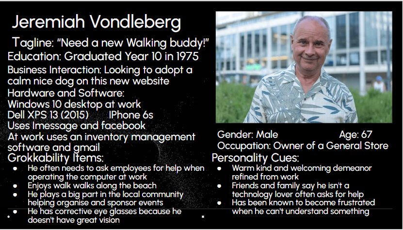
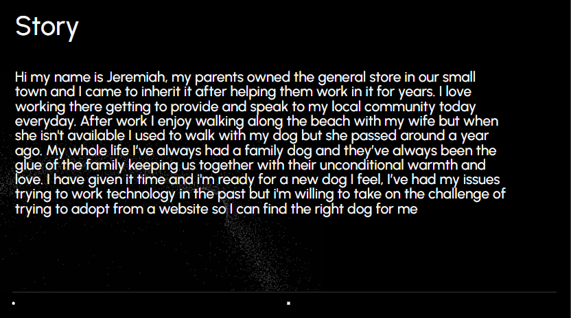

# Information Architecture and Low-Fidelity Wireframes

## SiteMap
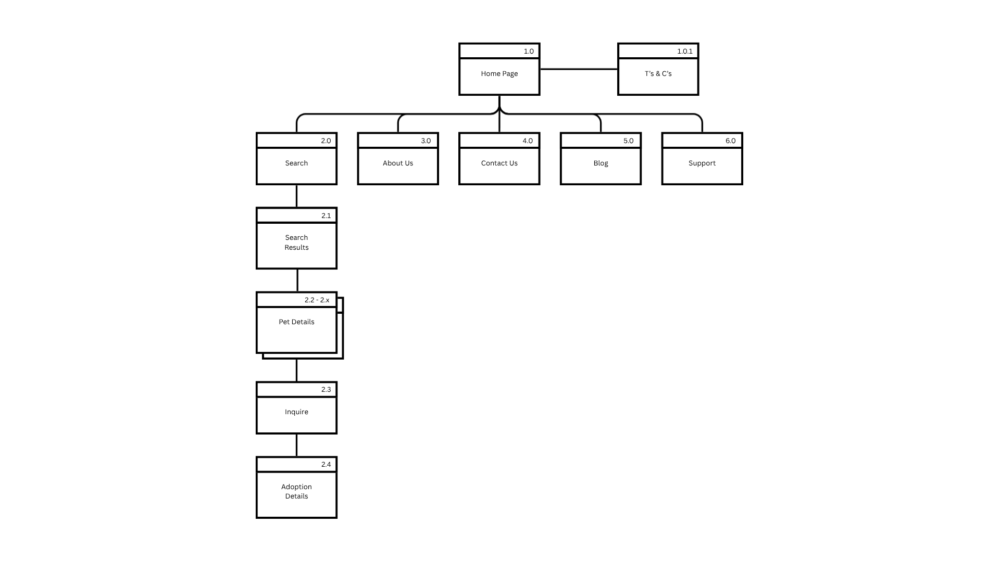

## User Flow Diagrams

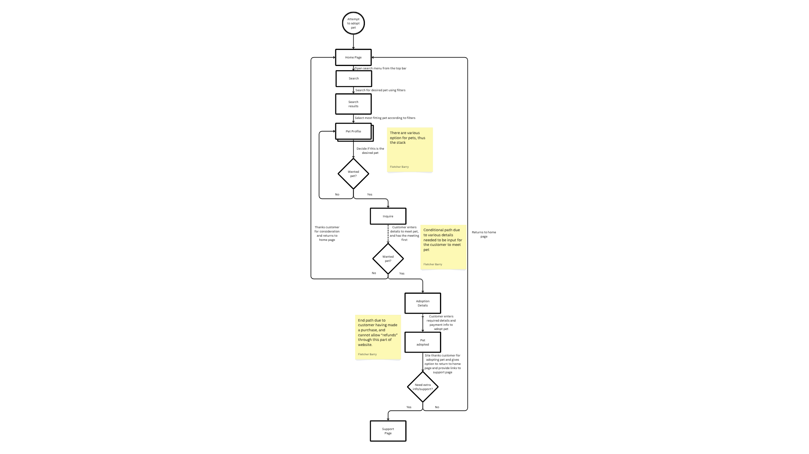
How to get to the adoption page - Fletcher Barry

Marcus Mcinery

.png)
How to get to the Pet details page - Caden Yates (Yate0081)

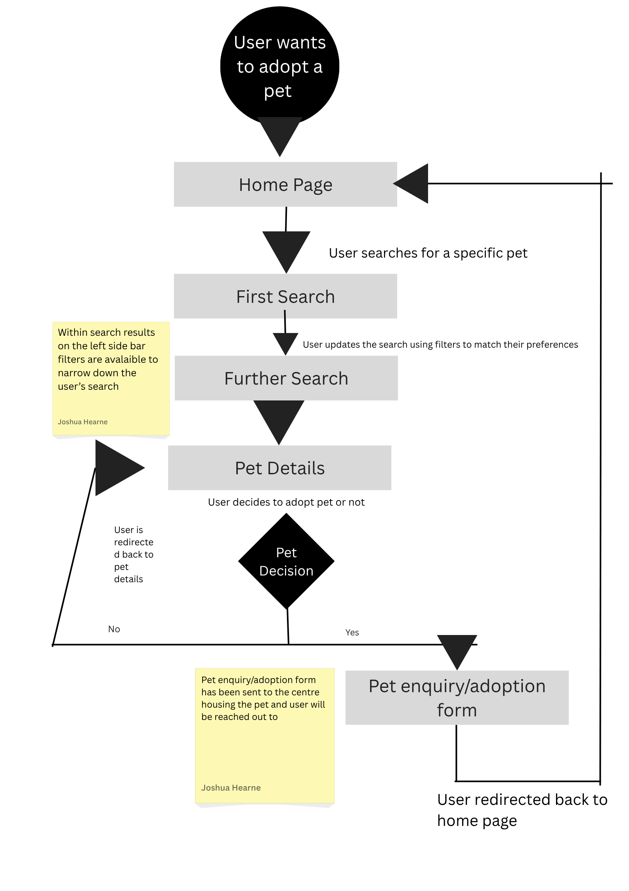
Joshua Hearne

## Low Fidelity Wireframes

### Adoption Page

Marcus McInerney

### Inquire Page

Marcus McInerney

### Search Results Page
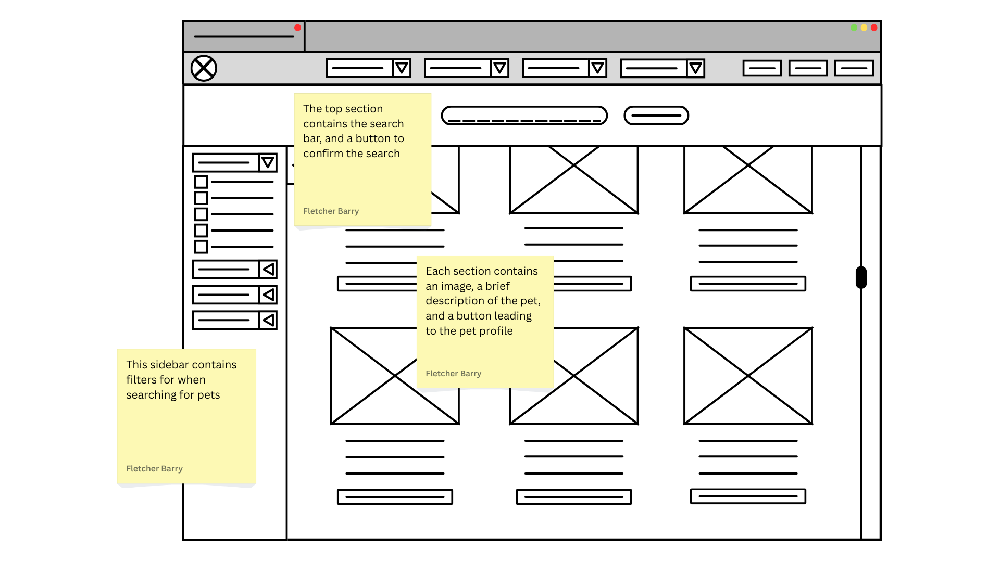
Fletcher Barry

### Support Page
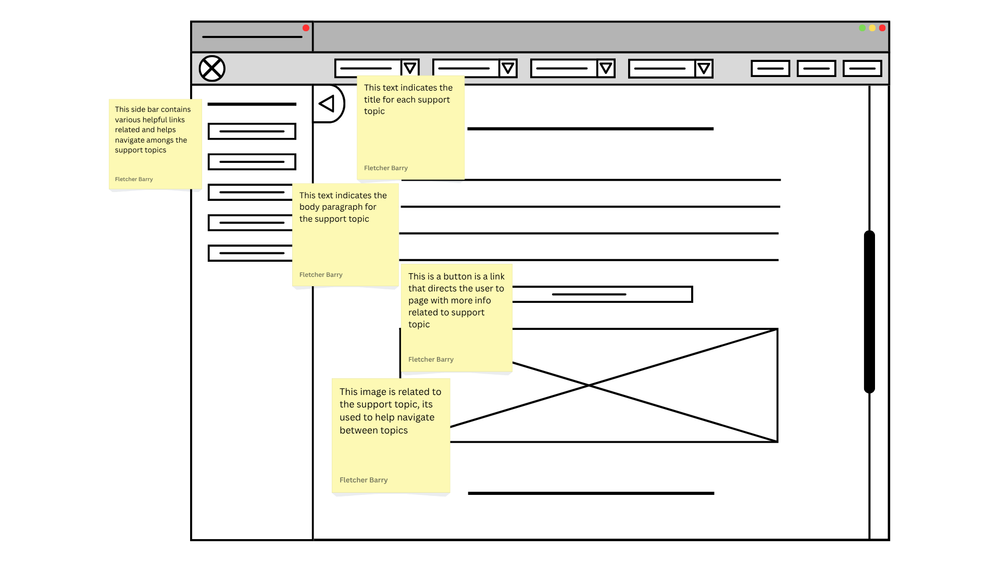
Fletcher Barry

### Pet Details Page

Caden Yates (Yate0081)

### Blog Page

Caden Yates (Yate0081)

### About Us Page
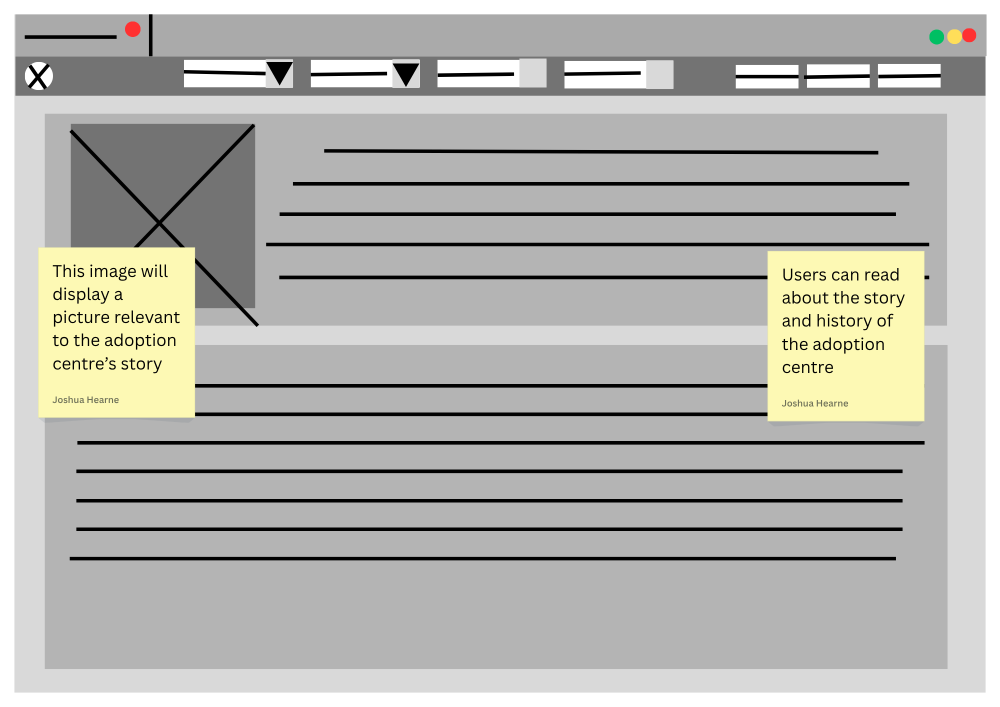
Joshua Hearne

### Contact Us Page
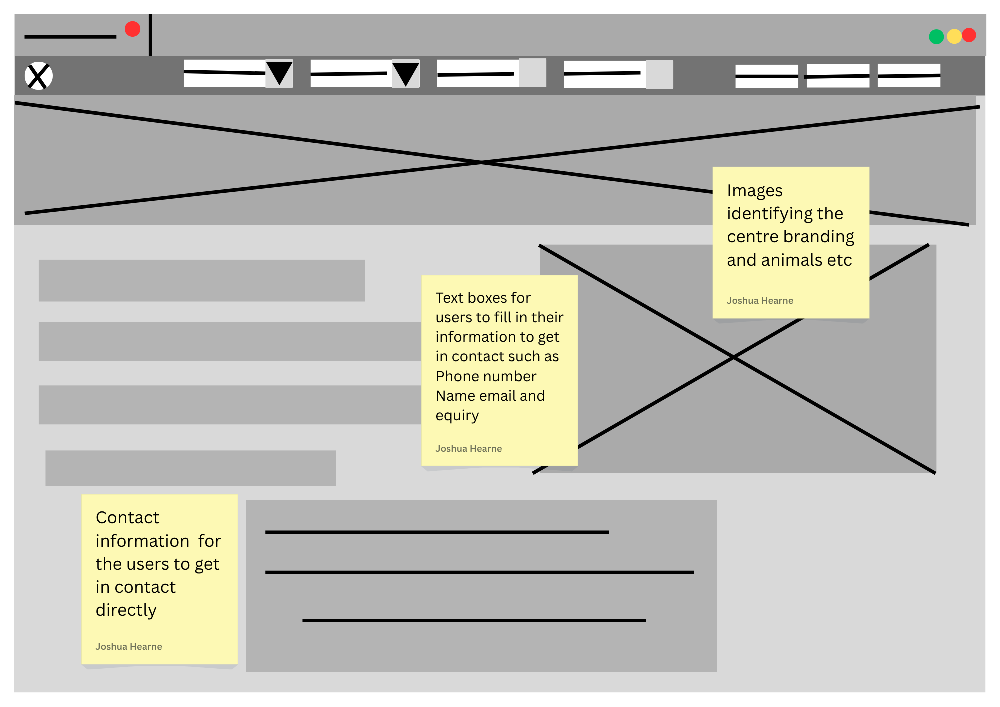
Joshua Hearne

## Storyboard Page

### Marcus StoryBoard

Marcus McInerney

### Access to Adoption Details Storyboard (Fletcher Barry)
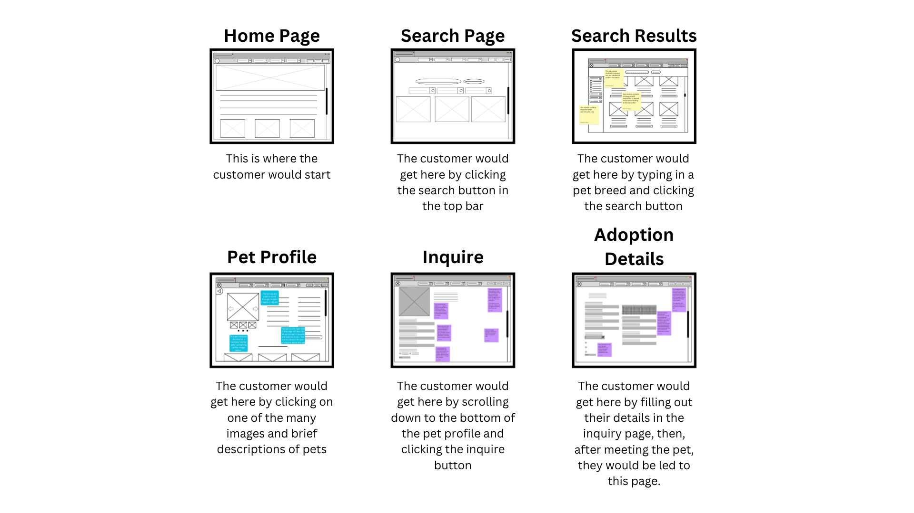
Fletcher Barry

### Access to Pet Details Page

Caden Yates (Yate0081)

### Access to the Adoption Form Storyboard (Joshua Hearne)
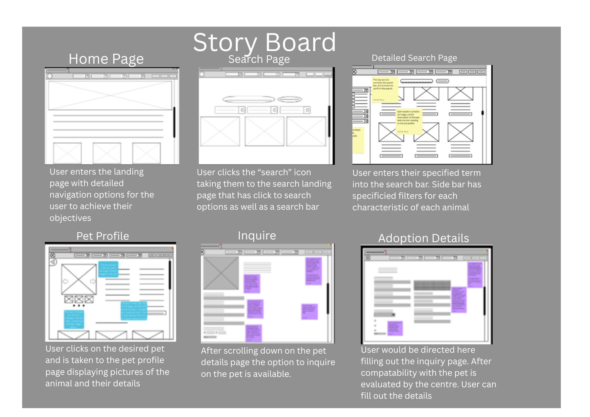
Joshua Hearne

# Predictive Analysis Summary

## GOMS Analysis

### Accessing Adoption Details for a "cat"

GOMS of User getting to Adoption Details page:

•	G: o	Access the Adoption Details Page for a cat •	O: 
o	Through specific filters for “cat” 
o	Through General filters for “cat” 
•	M: 
o	Through placing certain breed, age, and gender filters 
o	Through just searching cat and pressing search 
•	S: 
o	Needs to be what a user would most likely do when searching for a “cat” 

The simplest way a user would get to the adoption page of a cat would be to just search “cat” into the search page, and not applying filters. (Fletcher Barry)

### Marcus GOMS Analysis

### (Yate0081) GOMS Analysis

## KLM analysis Page

### Marcus KLM Analysis

### (Yate0081) KLM Analysis

### Accessing Adoption Details for a "cat"

| **TASK** | **INPUTS** | **TIME PER TASK (sec)** | **TOTAL CUMULARIVE TIME (sec)** |
| --- | --- | --- | --- |
| HOME PAGE - SEARCH | •	Navigate to Search tab  •   Click MHPP(1)R | 1.35   0.4   1.1   0.2   1 | 1.35  2.15 3.25 3.45 4.45 |
| SEARCH - SEARCH RESULTS | •	Navigate to search input box  •	search word cat •	click enter MHPP(1) MHKKK MHPP(1) R | 1.35 0.4 1.1 0.2   1.35 0.4 0.28 0.28 0.28  1.35 0.4 1.1 0.2  1 | 6.2 7 8.1 8.3  10.05 10.45 11.13 11.41 12.09  13.44 14.24 15.34 15.54  16.54
| SEARCH RESULTS - PET PROFILE | •	scroll down page •	click button for cat MHPP(1)P MPP(1) R | 1.35 0.4 1.1 0.2 1.1  1.35 1.1 0.2  1 | 18.29 19.09 20.19 20.39 21.49  23.24 24.34 24.54  25.54 |
| PET PROFILE - INQUIRE | •	scroll down page •	click inquire MHPP(1)P MPP(1) R | 1.35 0.4 1.1 0.2 1.1  1.35 0.4 1.1 0.2  1 | 27.29 28.09 29.19 29.39 30.49  32.24 33.04 34.14 34.34  35.34 |
| INQUIRE - ADOPTION DETAILS | •	enter details in all boxes •	name (Fletcher) •	last name (Barry) •	email (fann1234@flinders.edu.au) •	phone number (1234567890) •	meeting location •	date (01/01/2026) •	time •	click enter MHPP(1) MHKKKKKKKKK MHPP(1) MHKKKKKK MHPP(1) MHKKKKKKKKKKKKKKKKKKKKKKKKK MHPP(1) MHKKKKKKKKKK MHPP(1) MHPP(1)MPP(1) MPP(1) MHKKKKKKKKKKKK MHPP(1) MPP(1)MPP(1) MPP(1) R | 1.35 0.4 1.1 0.2  1.35 0.4 0.08 0.28 0.28 0.28 0.28 0.28 0.28 0.28 0.28  1.35 0.4 1.1 0.2  1.35 0.4 0.08 0.28 0.28 0.28 0.28 0.28  1.35 0.4 1.1 0.2  1.35 0.4 0.28 0.28 0.28 0.28 0.28 0.28 0.28 0.28 0.08 0.28 0.28 0.28 0.28 0.28 0.28 0.28 0.28 0.28 0.28 0.28 0.28 0.28 0.28 0.28 0.28  1.35 0.4 1.1 0.2  1.35 0.4 0.28 0.28 0.28 0.28 0.28 0.28 0.28 0.28 0.28 0.28  1.35 0.4 1.1 0.2 1.35 0.4 1.1 0.2 1.35 1.1 0.2  1.35 1.1 0.2  1.35 0.4 0.28 0.28 0.08 0.28 0.28 0.08 0.28 0.28 0.28 0.28  1.35 0.4 1.1 0.2  1.35 1.1 0.2 1.35 1.1 0.2  1.35 1.1 0.2  1 | 37.09  37.49 38.59 39.19  40.54 41.34 41.42 42.1 42.38 43.06 43.34 44.02 44.3 44.58 45.26  47.01 47.41 48.51 49.11  50.46 51.26 51.34 52.02 52.3 52.58 53.26 53.54  55.29 56.09 57.19 57.39  59.14 59.54 60.22 60.5 61.18 61.46 62.14 62.42 63.1 63.38 63.46 64.14 64.42 65.1 65.38 66.06 66.34 67.02 67.3 67.58 68.26 68.54 69.22 69.50 80.18 80.46 81.04  82.39 83.19 84.29 84.49  86.24 86.28 86.56 87.24 87.52 88.2 88.48 89.16 89.44 90.12 90.40 91.08  92.43 93.23 94.33 94.53  96.28 97.08 98.18 98.38 100.13 101.23 101.43  103.18 104.28 104.48  106.23 107.03 107.31 107.59 108.07 108.35 109.03 109.11 109.39 110.07 110.35 111.03  112.38 113.18 114.28 114.48  116.23 117.33 117.53 119.28 120.38 120.58  122.33 123.43 124.03  125.03 |

Fletcher Barry
