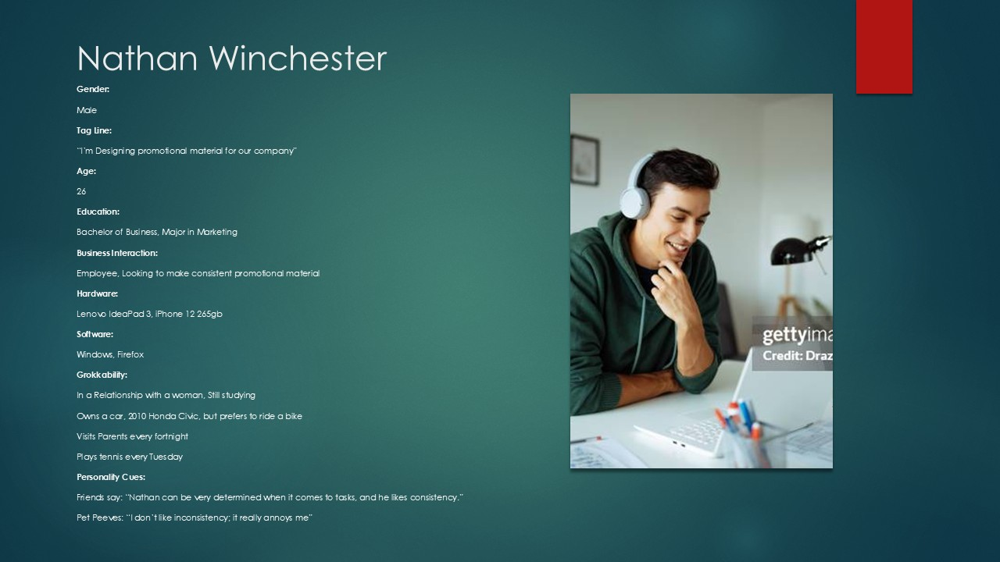
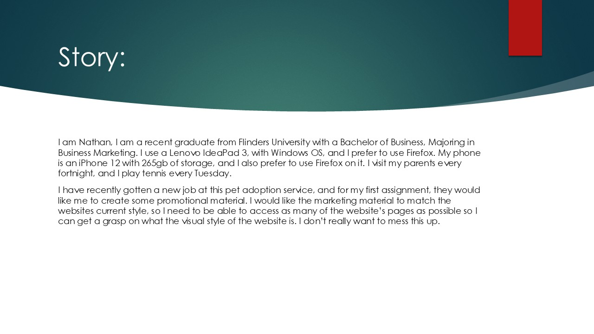
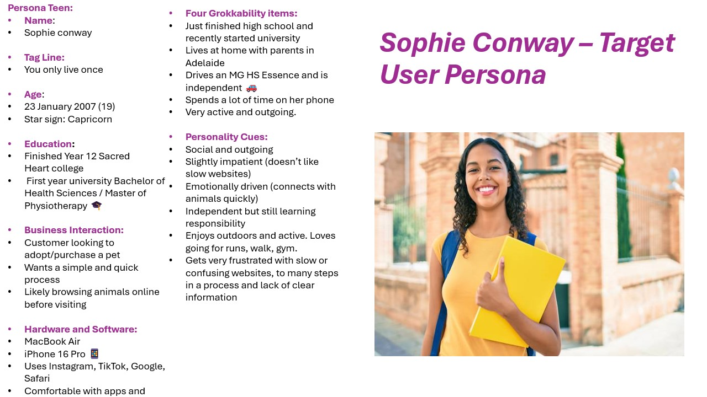
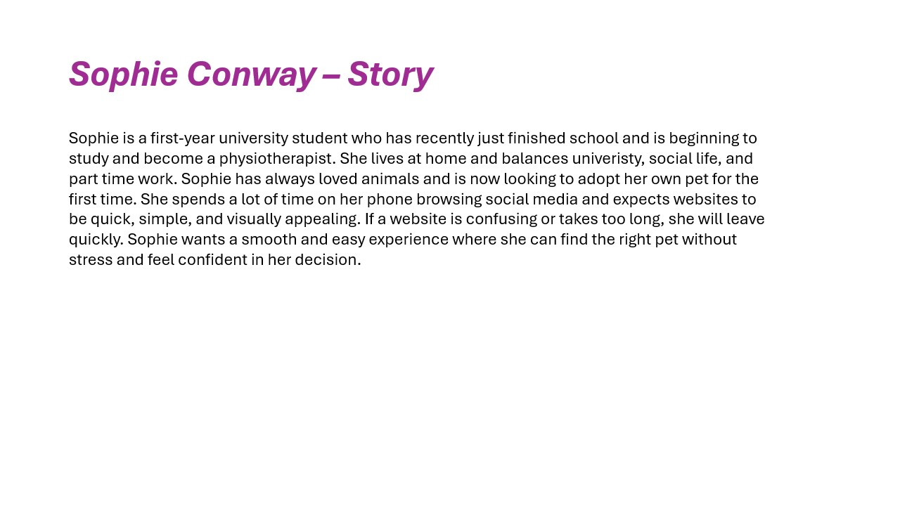

# Assignment 1: UX Design Report

- **Author**: Fletcher Barry, Marcus McInerney
- **FAN**: barr0606, mcin0389
- **Student ID**: 2368193, 2401481

[Comment]: # (Create your UX Design Report in this file.)

---
# Website Purpose
This website’s purpose is for customer to adopt animals for themselves, for their kids, to get company for other pets, or to give a pet to a loved one as a gift. It would serve as a way for people to adopt animals, and for a way for the shelter to get more adoptions. The problem this website would solve is that the shelter may be struggling to get pets adopted without as much accessibility that a website may give. It also provides a way for customers to see pets that they may like without needing to be onsite, and potentially risking some allergies, depending on what pet that they may want. The website would make adopting animals from this shelter much more accessible due to prevalent technology is now days, and how people would be more familiar and more comfortable with “online shopping” rather than going to a shelter and seeing the animals in person.     The target audience for this website is someone who maybe some what technologically smart, whilst being at an age that could afford to own a pet. This person may also be from a middle to high income household. There may be several reasons why this user may be on this website, for example, they could be looking for a pet for any kids they may have, or they could be looking for another pet after they lost a different pet or if a loved one may have passed away. There are several locations where this website may be accessed from, including home, university, or work. The internet connection for each site may vary.     There are going to be several different pages accessible throughout the website, you would start at the home page, where you would be able to access most of the other pages from there. The accessible pages would be the search page, about us, contact us, support, adoption details, and a blog page. There would be three other pages accessible only through using the search function and onwards. The first page accessible would be the search results page, which would show all related pets to the customers defined search criteria. The next page accessible would be the pet information page which would be accessed by clicking on one of the pets that would have shown up in the search results page. The next page would be the customer details, where the customer would put in their details to meet up with the animal of their choosing, this page would be entered upon selecting a button in the pet details page that would ask if they wanted to meet the animal. The last page accessible before returning to the home page would be the inquire page, this would show up after the customer has organized a time to meet the pet, this page would contain details about how the meeting may go and what behaviour the pet may present. It would also say how the customer may go about contacting the business regarding any questions or schedule updates that may arise. 

# User Details
**PACT Analysis Matrix**

| PACT Items | PACT Content |
| --- | --- |
| **People** | o	People that may go to the site, may have a wide variety of physical attributes. Some of these attributes may include those with disabilities that are maybe looking for a service animal. Some people may also be looking for a pet as an excuse to maybe get some exercise like going on a walk with a dog. Various ages would use the website, but it is unlikely that older people would use the site, due to most being unfamiliar with technology. Children are also unlikely to use the website, and if they were to, they would most likely be on there to look at the cute animals. The most likely age range would be teenagers to adults, due to this demographic being the most familiar with technology, and would also have the finances to adopt an animal for themselves, their family, or for someone that may need/want an animal. For example, and adult may want to get pet to help one of their parents from feeling lonely, and to give them something to do during their retirement.   o	The people that might be looking for a pet are people who may have recently lost a loved one or a pet, someone who wants to look after an animal, someone who may want to help rehome rescue animals. Some people may want to get a pet so they could get the feeling of looking after something without having to commit looking after a child.   o	People in lower-income households may not visit the website to look for a pet due to either not access to the right technologies or may not be able to feed another mouth. People in medium-income households would be the demographics that are most likely to visit our site due to having the right technology available to them, being able to afford to feed another mouth. It is also unlikely that medium-income households would want to adopt purebred’s due to how much they cost. There would be high-income households visiting the website than medium-income households due to their financial stability, and that high-income households may prefer to buy younger purebred animals or more exotic animals.   o	There would three type of users that would use the website: The Admin, the employees, and the adopters/customers. |
| **Activities** |- Browsing through pet listings   - Reading pet profies   - View images/videos   - Complete applications for adopting   **Temporal** -   Pet adoption often occurs over multiple sessions as users may casually browse at first to search for a pet that meets there desire. This can result in time pressure as a pet they may end up desiring recieves other aplications. Once the application has been submitted users will need to wait for a decision to be made from the shelter after review. Providing a favourites option may reduce time browsing along with notifications for updates on pets or similar breeds.   **Cooperation** -   Users are more likely to browse individually followed by a discussion with family members to make a final decison. Communication and cooperation while completing an application requires shelter staff. The website will need to provide discussion channels and tools to allow users to share desired profiles with family memebers.   **Complexity** -   The Complexity activities can vary depending on the task, searching should be easy, whereas completing the application process and ensuring the suitablity between the family and pet is optimal can be more difficult.   **Safety**-   Whilst there are no physical risks in searching for a pet online, there are risks assosiated to user actions. If the match between the owner and the pet is illsuited this can lead to stress or unsuitable living conditions for the animal. Accurate and detailed information for the pet will need to be provided along with clear instructions of the adoption process to minimise risk that can cause stress to the user, animal and shelter staff as rehoming a pet may difficult.    
| **Context** | Users may access the website in different environments such as at home, university, or work. They may experience distractions, time pressure, or noise depending on the situation. Internet connection may vary, so the system should be easy to use even with slower speeds. The design should support quick navigation and clear information so users can complete tasks efficiently in different contexts. |
| **Technologies** | |

**User Persona**

# Information Architecture and Low-Fidelity Wireframes
# Predictive Analysis Summary